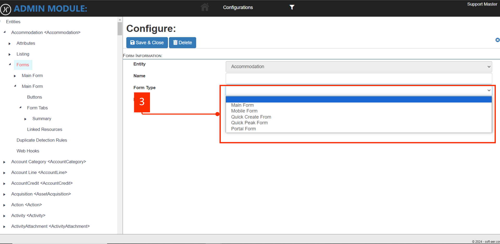

# Forms

When adding a new form, you navigate to the entity you would like to add a form from, If the current entity has existing forms added, it will show them on the dropdown and on the grid as shown below. \
To add a new form click the following <mark style="color:blue;">**Add New**</mark> button shown on <mark style="color:orange;">**#1.**</mark>&#x20;

<figure><figcaption>
<mark style="color:red;">Click Image to view full screen</mark>
</figcaption></figure>

Below, is the form to will get when you click add  new form. The field at <mark style="color:orange;">**#1**</mark> is a read-only field that is prepopulated, which is the entity you are currently on. At <mark style="color:orange;">**#2**</mark> is the name of the form, which is the display name, the field at <mark style="color:orange;">**#3**</mark> is a select option for the type of you want to add. The Default Checkbox at <mark style="color:orange;">**#4**</mark>&#x20;

<figure><figcaption>
<mark style="color:red;">Click image to view full screen</mark>
</figcaption></figure>

Below at <mark style="color:orange;">**#3**</mark> is the different **Form types** available on Ezra. You can add more than one main forms in the same entity,&#x20;

<figure><figcaption></figcaption></figure>

These are the properties available to configure a tab when you create or edit a form using the form configure.&#x20;

| Field Name | Description                                                                                                        |
| ---------- | ------------------------------------------------------------------------------------------------------------------ |
| Entity     | The entity is auto preselected based on the entity you are adding the form on. Which makes this field a read-only. |
| Name       | The name of the form which is also a display name for the form you are adding                                      |
| Form Type  | Main Form, Mobile Form, Quick Create form, Quick Peak form, and Portal form                                        |
| Default ☑  | The default checkbox is a Boolean                                                                                  |

