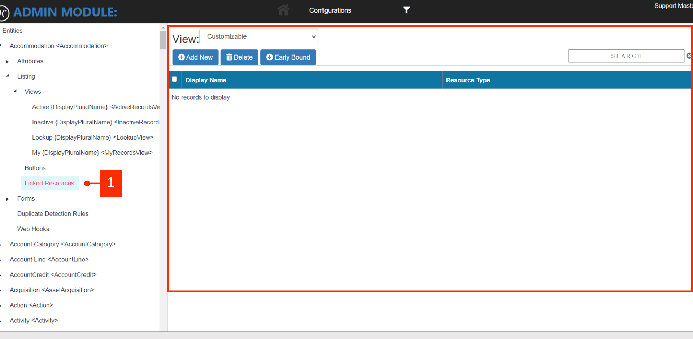
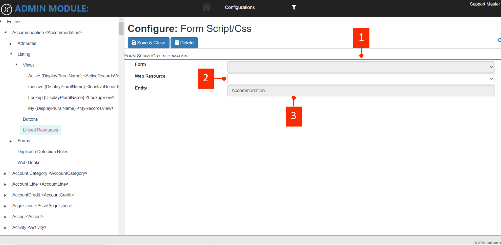

# Linked Resources

Linked Resources refers to a capability within an Ezra entities that allows users to associate or link external files (such as documents or code files) with specific records. This functionality is often related to document management and attachments. You can manage and access these linked resources directly from the entity records or in the [resources.md](../../resources.md "mention") tab.

Below, you can click the point <mark style="color:orange;">**#1**</mark> to see available resources linked to the specific entity. To add a new entity you can click the "**Add New**" button.&#x20;

<figure><figcaption></figcaption></figure>

When you are linking a new resource  with entity the following form will appear. The point at <mark style="color:orange;">**#1**</mark> is read only field. The point <mark style="color:orange;">**#2**</mark> returns all uploaded resources at [resources.md](../../resources.md "mention") for you to choose from, and the point at <mark style="color:orange;">**#3**</mark> is also auto-selected to the current entity you are on hence it is a read-only field.

<figure><figcaption></figcaption></figure>
