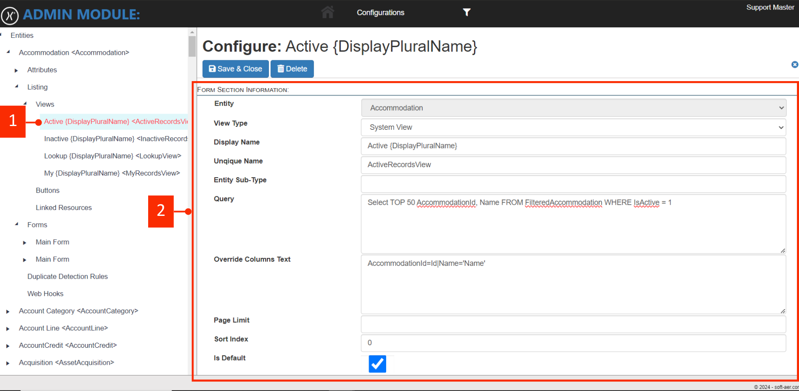
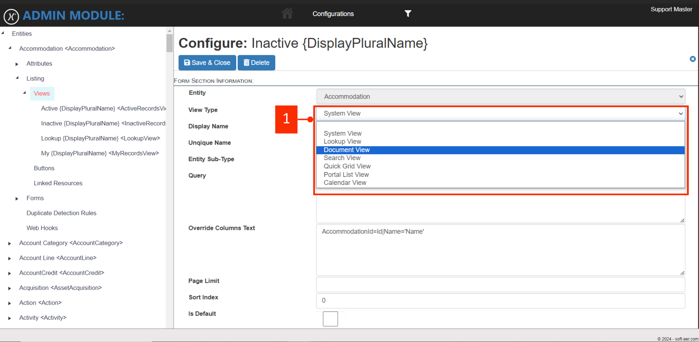

# Views

The image below shows the views available for the entity. <mark style="color:orange;">**#1**</mark> shows the list of a views available , and also in the grid table. The default views that gets created with the entity are, **Active**, **Inactive**, **Lookup** and **My** Views. To add a new view, click the "**Add New**" button the the form will open where you can add view information.

<figure><figcaption><p><mark style="color:red;">Click image to view full screen</mark></p></figcaption></figure>


```sql
Select TOP 50 AccommodationId, Name FROM FilteredAccommodation WHERE IsActive = 1
```


The following form will be display with the fields to be filled. You select the **System View** on the **View Type** SQL query in the Query field. Look at the query example above.\
\
The when modifying a existing view, you click at the point #1 and then form will appear for you to modify.&#x20;

<figure><figcaption></figcaption></figure>

On the following example on <mark style="color:orange;">**#1**</mark> View Type we have the following different types of views.

<figure><figcaption></figcaption></figure>


| View Type        | Description |
| ---------------- | ----------- |
| System View      |             |
| Document View    |             |
| Search View      |             |
| Lookup View      |             |
| Quick Grid View  |             |
| Portal List View |             |
| Calendar View    |             |
