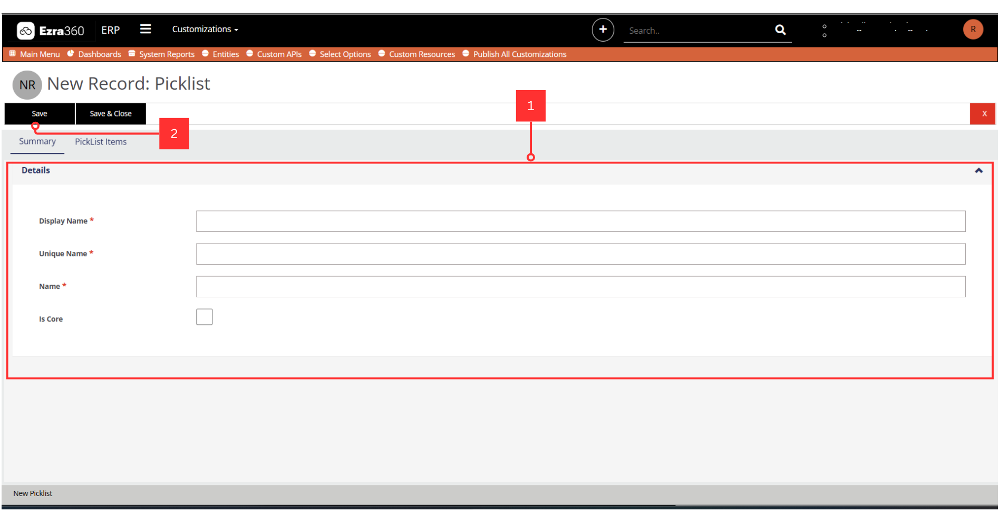

# Select Options

***

**Select Options** has Select Types. Click <mark style="color:orange;">**#1**</mark> to view all the **Selection Option Types.**&#x20;

The **Select Option Types** can be configured by clicking on  <mark style="color:orange;">**#1**</mark> dropdown select to **Customizations,** then select <mark style="color:orange;">**#2**</mark>**&#x20;Select options** then the grid will show all available select options. To add new Select Option types, click on the <mark style="color:orange;">**#3**</mark>**&#x20;New** button. The [#add-new-select-option-type](select-options.md#add-new-select-option-type "mention")shows how to add new select option.&#x20;

<figure><figcaption></figcaption></figure>

#### Add New Select Option Type

The form <mark style="color:orange;">**#1**</mark> shows input fields for adding a new **Select Option Type.**&#x20;

> Note: You need to <mark style="color:$warning;">**#2**</mark> Save first before you could add PickList Items

<figure><figcaption>
<mark style="color:red;">Click image to view full screen</mark>
</figcaption></figure>

To add a new select dropdown, click on <mark style="color:orange;">**#1**</mark>**&#x20;Pick List Items** to view all the available **select options** in a grid form.\
Each select option has its own _Display name_, Option Value and sort Index which allow you to order your pick list Items in the order of choice. \
You can check **Select Options** on the grid and then delete the&#x6D;_. To add a new Select Option, you will click on <mark style="color:$warning;">**#**</mark>_<mark style="color:$warning;">**2**</mark>**&#x20;Add New.** 

<figure><figcaption>
<mark style="color:red;">Click image to view full screen</mark>
</figcaption></figure>

**To Add a new Select Option:**\
The form in <mark style="color:orange;">**#1**</mark> and its field where select option data is filled.&#x20;

The **Option Value**  field is the _Unique Name_ that is autogenerated.\
The **Option Text** field is the where you name your _Select Option_ value.\
The **Sort Index** field is where you will give the Selection Option an order index value.&#x20;

The **PickListId** Will then be the name of the Select Options main Name

\
Click on the <mark style="color:orange;">**#2**</mark> **Save and Close** button to save.&#x20;

<figure><figcaption>
<mark style="color:red;">Click image to full screen</mark>
</figcaption></figure>
