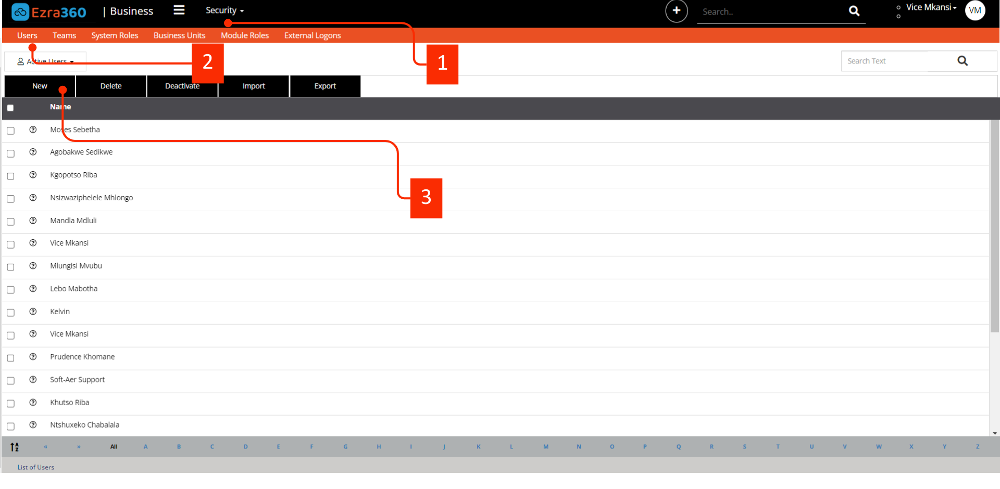
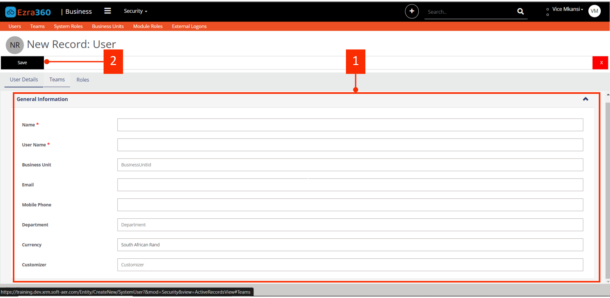

# Create New Users

This is a guide on how to add a new user on Ezra360. This list includes both internal employees and external customers or vendors. Users can be added manually or imported. Ensure all users have the appropriate licenses for compliant use.

### Purchase a License

For details on purchasing and licensing , refer to the Ezra360 Licensing Guide here [https://ezra360.com/contact/](https://ezra360.com/contact/)&#x20;

### Grant Access to a User

System Administrator are eligible to assign access to users in the <mark style="color:blue;">**Security**</mark> Module\
External users need to be added in your tenant directory to be assigned roles. These users should be added as new users and then given the appropriate roles. For a specific applications, it is necessary that the guest user's company also uses the organization's mail.

### Manually add a new user

For users with existing tenant. To add a new user, Look at the following example on the provided screen.

1. Navigate to the Security Module as shown in <mark style="color:orange;">**No.1**</mark>
2. Click on <mark style="color:orange;">**2**</mark> on the **Users** Entity/Sub-Module. You will see a list of all existing users.
3. Click on <mark style="color:orange;">**3**</mark> to add a new user, this will then open a new form to add a new user details.

<figure><figcaption>
<mark style="color:red;">Click image to view full screen</mark>
</figcaption></figure>

Fill the User Details Form. After clicking the **New** Button, the following form will be displayed to fill user details. On the form in <mark style="color:orange;">**1.**</mark>


All fields marked with red asterisks (<mark style="color:red;">**\***</mark>) are required. Your form will not be submitted when these fields are not filled.


1. **Name**<mark style="color:red;">**\***</mark> : This is the full name of the user.
2. **User Name**<mark style="color:red;">**\***</mark> : This is the organization user email. Enter the user's full email.
3. **Business Unit**: This is a lookup field that returns all Business unit your organization have. Select one of them.
4. **Email**: This is the email field, enter the user's full Email/User Principle Name.
5. **Mobile Phone**: Enter user's mobile number.
6. **Department**: The organization has to setup its own departments. Select the department you are in.
7. **Currency**: The currency your organization uses.
8. **Customizer**

When your form is filled, click the save button on <mark style="color:orange;">**2,**</mark> to save and create a new user.

<figure><figcaption>
<mark style="color:red;">Click image to view full screen</mark>
</figcaption></figure>
