# Clean Architecture and Coding Standards Guide

\
**Technology focus:** Flutter, Dart, BLoC/Cubit, feature-first Clean Architecture, repository contracts, Freezed, explicit cache boundaries, and automated testing\
**Document type:** Architecture standard / Technical Design Document reference / onboarding guide\
**Audience:** Junior and senior mobile developers, technical leads, QA engineers, solution architects, product owners, and reviewers\
**Version:** Draft v2.1 \
**Updated:** 21 July 2026

> **Architecture promise**\
> A feature should be understandable by reading its events, states, use cases, repository contract, and data-source implementation. The UI should not need to know where data comes from, whether a cache exists, or how an API payload is shaped. Code should be named clearly enough that a reviewer can understand the intent before reading the implementation details.

> **Diagram assets**\
> Every architecture diagram is embedded below as Scalable SVG. The editable Mermaid source is retained beneath each figure.

***

### Contents

1. Purpose and how to use this guide
2. Standards language and engineering principles
3. High-level Clean Architecture view
4. Layer-by-layer responsibilities
5. Standard request, command, and state flow
6. Repository, cache, and data-source decision rules
7. Feature-first folder structure
8. General coding practices
9. Naming standards
10. Immutability and Freezed standards
11. Function and class design
12. BLoC and state-management standards
13. DTO, entity, mapping, and serialization standards
14. Dependency injection and configuration
15. Error handling, observability, and security
16. Flutter UI, accessibility, and responsive design
17. Performance and reliability
18. Testing strategy and quality gates
19. Documentation, source control, and code review
20. New feature delivery checklist
21. Definition of Done
22. Anti-patterns to avoid
23. Appendix A: practical Flutter and Dart examples
24. Appendix B: Mermaid diagrams
25. References and maintenance notes

***

## 1. Purpose and how to use this guide

This document defines a reusable engineering standard for Flutter applications. It expands the architecture rules into practical coding guidance so that a new developer can understand where code belongs, why it belongs there, how it should be named, and how it should be tested.

The guide is deliberately written for mixed-experience teams:

* A **junior developer** should be able to follow the examples and produce code that fits the existing application without guessing.
* A **senior developer** should be able to use the rules as review criteria, challenge exceptions, and evolve the architecture without weakening its boundaries.
* A **QA engineer** should be able to identify which behaviours belong in unit, BLoC, widget, integration, and release tests.
* A **solution architect or technical lead** should be able to verify source-of-truth decisions, integration boundaries, security controls, and cache behaviour.

### 1.1 Recommended reading path

| Reader                       | Recommended focus                                                                   |
| ---------------------------- | ----------------------------------------------------------------------------------- |
| New mobile developer         | Read sections 2-12 first, then use sections 20-21 while delivering a feature.       |
| Senior developer or reviewer | Read sections 3-19 and use sections 21-22 during reviews.                           |
| QA or automation engineer    | Focus on sections 5, 12, 18, 20, and 21.                                            |
| Solution architect           | Focus on sections 3-7 and 13-17.                                                    |
| Product owner or analyst     | Focus on sections 4-6 to understand how business requirements become app behaviour. |

### 1.2 Scope

This guide covers:

* application architecture and dependency direction;
* feature-first module organisation;
* presentation, BLoC, use-case, domain, data, and infrastructure responsibilities;
* repository and cache decisions;
* variable, method, class, file, event, and state naming;
* immutable entities and states using Dart and Freezed;
* DTO-to-domain mapping and error handling;
* dependency injection and environment configuration;
* UI composition, accessibility, security, performance, and observability;
* unit, BLoC, widget, integration, and release testing;
* pull-request expectations and a Definition of Done.

### 1.3 What this guide does not do

This guide does not require every feature to have the same number of files or classes. Small features may remain small. The requirement is that dependencies and responsibilities stay clear. Additional layers are only valuable when they remove ambiguity, protect business rules, or improve testability.

> **Definition**\
> In this guide, **TDD** means **Technical Design Document** unless the phrase _test-driven development_ is written in full.

***

## 2. Standards language and engineering principles

### 2.1 Meaning of MUST, SHOULD, and MAY

* **MUST**: required for consistency, correctness, security, or architectural integrity. An exception requires explicit technical approval.
* **SHOULD**: the normal approach. A different approach is acceptable when the reason is documented and tested.
* **MAY**: optional guidance that can improve clarity or maintainability depending on the feature.

### 2.2 Core principles

| Principle                            | Meaning in practice                                                                                                                                  |
| ------------------------------------ | ---------------------------------------------------------------------------------------------------------------------------------------------------- |
| Feature-first ownership              | A feature contains its presentation, domain, and data code. Shared code moves to `core` only when it is genuinely reusable across multiple features. |
| Dependency inversion                 | The domain defines repository contracts. The data layer implements them. Use cases depend on stable interfaces rather than concrete API clients.     |
| UI is not the source of truth        | Widgets render state and dispatch intent. They do not make HTTP calls, parse DTOs, choose cache strategy, or implement business rules.               |
| One action, one clear responsibility | A use case or method should represent a recognisable action, such as `SubmitLeaveRequest`, `AcknowledgePolicy`, or `LoadBanners`.                    |
| Explicit state                       | Loading, loaded, empty, submitting, success, and error conditions are modelled deliberately rather than hidden in unrelated booleans.                |
| Explicit cache policy                | Every repository method has a documented source of truth, TTL, refresh strategy, and offline behaviour.                                              |
| Domain language is stable            | Entities, repository contracts, and use cases use product language rather than backend field names.                                                  |
| Immutability by default              | Domain values, BLoC states, events, and DTOs are immutable unless controlled mutation is genuinely required.                                         |
| Readability before cleverness        | Code should make intent obvious to another developer. Short code is not automatically clear code.                                                    |
| Test at the correct boundary         | Pure rules are tested without Flutter. UI rendering is tested as widgets. Critical journeys are tested through integration tests.                    |

### 2.3 Source-of-truth principle

Backend and integration services remain authoritative unless an approved offline-first design states otherwise. Local storage can improve speed and resilience, but it must not silently become a second source of truth.

Transactional operations such as checkout, final submission, approval, cancellation, delegation assignment, or cart updates should normally be online-only. If offline transactions are required, the design must define conflict handling, idempotency, retries, reconciliation, and user-visible status.

### 2.4 Rule of least surprise

A developer reading a feature should be able to predict:

1. where the screen dispatches an action;
2. which BLoC or Cubit receives it;
3. which use case represents the action;
4. which repository contract is called;
5. whether cache is allowed;
6. where DTOs are mapped;
7. which state is emitted for success and failure;
8. which test proves the behaviour.

When a feature breaks this expected flow, the reason must be visible in the TDD or code comments.

***

## 3. High-level Clean Architecture view

<br>

<figure>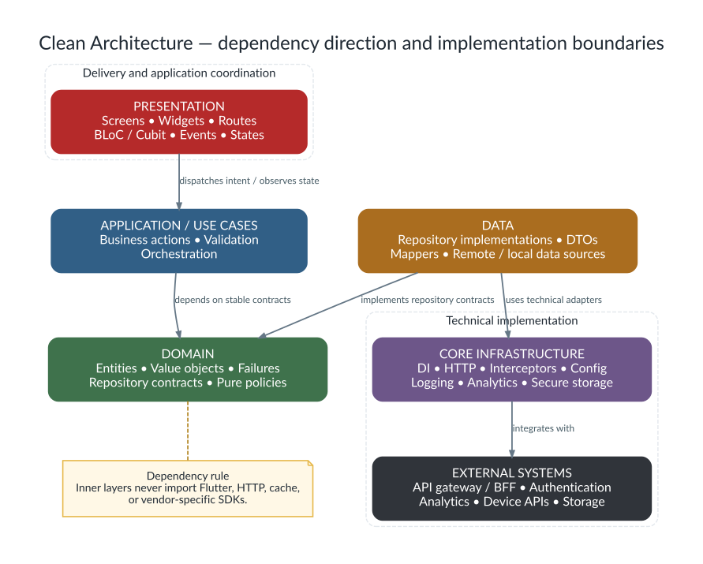<figcaption></figcaption></figure>

_Figure 1. High-level Clean Architecture view showing dependency direction and implementation boundaries._

<details>

<summary>Editable Mermaid source</summary>

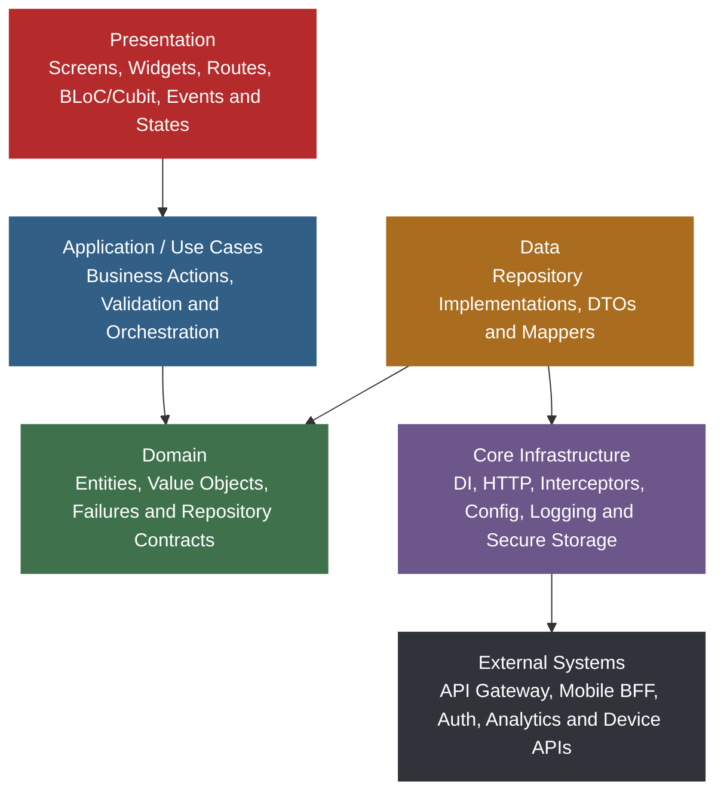

</details>

The outer layers deal with delivery mechanisms and technology: Flutter widgets, BLoC, HTTP, local storage, device APIs, analytics, and vendor SDKs. The inner layers hold product terminology, business rules, and contracts. Dependencies point toward stable abstractions.

> **Key rule**\
> Inner layers must not import Flutter widgets, HTTP clients, cache implementations, or vendor-specific SDKs. Outer layers may depend on inner contracts.

***

## 4. Layer-by-layer responsibilities

### 4.1 Responsibility matrix

| Layer               | Owns                                                                                                                                                                        | Must not own                                                                                          |
| ------------------- | --------------------------------------------------------------------------------------------------------------------------------------------------------------------------- | ----------------------------------------------------------------------------------------------------- |
| Presentation        | Screens, widgets, routes, visual state, BLoC/Cubit, events, states, loaders, error views, empty views, accessibility labels, and test keys.                                 | HTTP calls, DTO parsing, cache decisions, persistence, or reusable business rules.                    |
| BLoC / Cubit        | UI orchestration, event handling, state progression, use-case invocation, and translating domain results into presentation state.                                           | API payload knowledge, SQL/cache code, direct storage calls, or complex reusable domain calculations. |
| Use cases           | A single business action, typed parameters, action-level validation, and repository calls.                                                                                  | `BuildContext`, widgets, navigation, concrete HTTP clients, local-storage APIs, or response DTOs.     |
| Domain              | Entities, value objects, repository contracts, failures, pure policies, and business terminology.                                                                           | Flutter imports, JSON annotations, API casing, database schemas, and concrete infrastructure.         |
| Data                | Repository implementations, DTOs, mappers, remote/local data sources, cache policy, secure-storage adapters, and technical error mapping.                                   | Widget rendering, route decisions, or UI-specific state.                                              |
| Core infrastructure | DI, HTTP helper, interceptors, environment config, logging wrappers, analytics wrappers, secure-storage wrappers, feature flags, shared theme, and common error primitives. | Feature-specific product rules that belong in a feature domain.                                       |

### 4.2 Presentation layer

The presentation layer is the only layer that should understand Flutter visual concepts such as `BuildContext`, pages, dialogs, snackbars, responsive constraints, animation, focus, semantics, and themes.

Presentation code MUST:

* dispatch events or call Cubit methods in response to user interaction;
* render from state rather than hidden global values;
* show loading, empty, loaded, success, and failure experiences consistently;
* use stable `Key` values for critical integration paths;
* keep side effects such as navigation, dialogs, and snackbars outside pure builders;
* separate large pages into focused widgets without scattering business logic.

Presentation code MUST NOT call a repository, remote data source, or HTTP helper directly.

### 4.3 BLoC and Cubit layer

A BLoC receives events; a Cubit exposes methods. Both coordinate user intent and state. The choice should be deliberate:

* Use **BLoC** when named events, event concurrency, auditability, or complex journeys improve clarity.
* Use **Cubit** for smaller state machines where method calls remain explicit and testable.

A BLoC or Cubit SHOULD make the journey visible through state changes. For example:

`initial -> loading -> loaded -> submitting -> submitted`

or

`initial -> loading -> error -> loading -> loaded`

Avoid a single state containing many unrelated flags unless those flags truly represent simultaneous conditions.

### 4.4 Use-case layer

Use cases express actions in product language. They protect the BLoC from repository details and provide a dedicated place for action-specific validation.

Good examples:

* `GetPolicies`
* `AcknowledgePolicy`
* `LoadLeaveBalances`
* `SubmitLeaveRequest`
* `AssignDelegate`
* `UploadProfilePhoto`

A use case SHOULD:

* have one public execution method, commonly `call`;
* accept a parameter object when more than one value is required;
* return a domain value or `Either<Failure, T>`;
* be independently unit-testable;
* avoid framework imports.

### 4.5 Domain layer

The domain layer should be understandable by someone who knows the business but not the API shape. It contains nouns and rules such as `Employee`, `Policy`, `LeaveRequest`, `DelegationPeriod`, and `ApprovalStatus`.

The domain MAY contain pure derived properties and business methods when those rules belong naturally to the entity or value object. For example, an `Employee` may expose `isDelegationActiveAt(date)` when the calculation depends only on the employee's immutable data.

### 4.6 Data layer

The data layer performs I/O and translates external shapes into internal values.

* A **remote data source** performs API calls and returns DTOs or technical response objects.
* A **local data source** reads or writes cache, preferences, secure storage, or a local database.
* A **repository implementation** chooses remote, cache, or both and maps results into domain objects.
* A **mapper** converts DTOs into entities and keeps backend naming away from the rest of the application.

A repository implementation must not return raw `DioException`, JSON maps, database records, or vendor SDK objects to the domain or presentation layers.

***

## 5. Standard request, command, and state flow

<figure>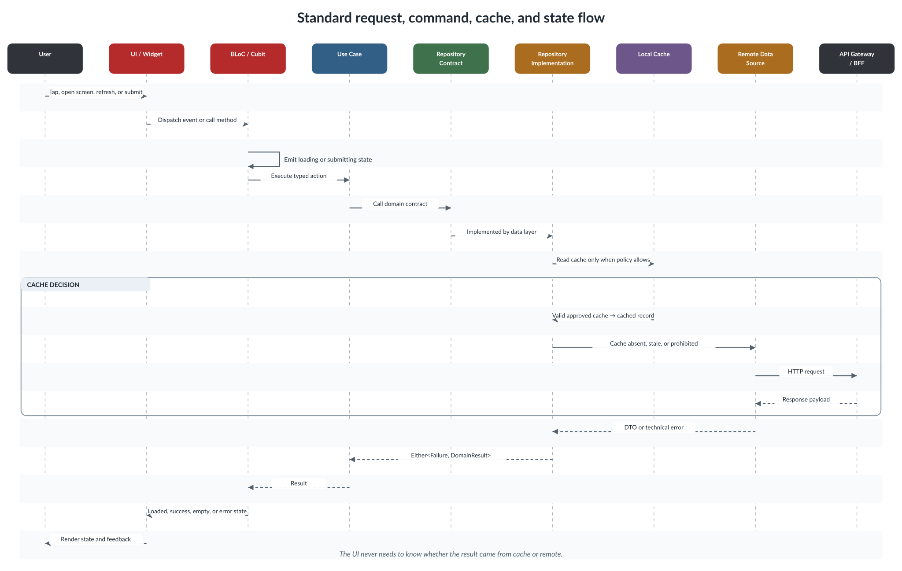<figcaption></figcaption></figure>

_Figure 2. Standard request, command, cache, and state flow from user intent to rendered feedback._

<details>

<summary>Editable Mermaid source</summary>

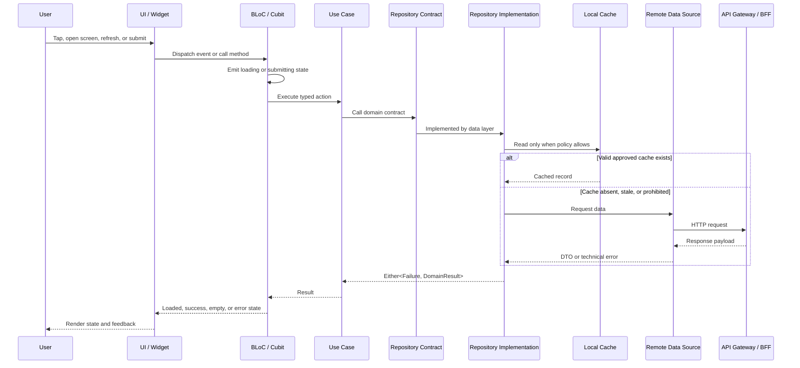

</details>

### 5.1 Query flow

A query loads or refreshes data. The preferred sequence is:

1. UI dispatches a load or refresh event.
2. BLoC emits loading, or preserves existing data and marks it as refreshing.
3. Use case calls the repository contract.
4. Repository applies its cache/remote policy.
5. Data source returns DTO or technical error.
6. Repository maps DTO to domain and exception to `Failure`.
7. BLoC emits loaded, empty, or error state.
8. UI renders the state without knowing the source.

### 5.2 Command flow

A command changes state: submit, approve, cancel, delete, acknowledge, upload, or assign.

Commands SHOULD preserve user context where possible. Instead of replacing a complete detail screen with a blank spinner, keep the current content visible and show an overlay or disable the relevant action.

| Command                    | Recommended UX pattern                                                                                                  |
| -------------------------- | ----------------------------------------------------------------------------------------------------------------------- |
| Acknowledge, approve, save | Keep content visible, show processing feedback, then show success or contextual error.                                  |
| Form submission            | Validate locally, emit submitting, call use case, keep input until success, then navigate or reset deliberately.        |
| Delete or cancel           | Confirm destructive intent, emit processing, call use case, update list/detail only after confirmed success.            |
| Upload                     | Show progress or processing state, prevent duplicate submission, retain previous image/data until replacement succeeds. |

### 5.3 State progression examples

#### Initial load

`initial -> loading -> loaded`

#### Initial load failure with retry

`initial -> loading -> error -> loading -> loaded`

#### Command while data is already visible

`loaded -> submitting(currentData) -> submitted(updatedData)`

or

`loaded -> submitting(currentData) -> submissionError(currentData, message)`

#### Empty result

`initial -> loading -> empty`

An empty result is not automatically an error. It should normally have a dedicated state or a loaded state with an empty collection and explicit empty-view semantics.

***

## 6. Repository, cache, and data-source decision rules

Caching is an architecture decision, not an accidental optimisation. Each repository method MUST define its policy.

### 6.1 Common strategies

| Strategy                   | Description                                             | Appropriate use                                                                |
| -------------------------- | ------------------------------------------------------- | ------------------------------------------------------------------------------ |
| Online-only                | Always request the authoritative service.               | Transactions, approvals, checkout, final submission, live balances.            |
| Cache-first                | Return valid cache before remote.                       | Stable reference/catalogue data with an approved TTL.                          |
| Remote-first with fallback | Try remote; use approved cache when the network fails.  | Display-oriented data where slightly stale content is acceptable.              |
| Stale-while-revalidate     | Return cache immediately and refresh in the background. | Non-transactional lists where fast startup matters and refresh can be visible. |
| Offline-first              | Record local intent and synchronise later.              | Only with a designed conflict and reconciliation model.                        |

### 6.2 Recommended policies by data type

| Data type                 | Recommended approach                                                     | Reason                                                 |
| ------------------------- | ------------------------------------------------------------------------ | ------------------------------------------------------ |
| Catalogue/reference data  | Cache with an approved TTL, such as seven days when product rules allow. | Changes slowly and is frequently read.                 |
| Transactional state       | Online-only unless an offline transaction design is approved.            | Prevents duplicate or stale commands.                  |
| Tokens and secrets        | Secure storage only. Never normal cache or logs.                         | Protects sensitive session material.                   |
| Banners/news/content      | Remote-first or short-lived cache based on freshness rules.              | Content may be time-bound.                             |
| Profile or directory data | Remote-first with optional display fallback.                             | Backend remains authoritative.                         |
| Feature configuration     | Resolve through a configuration or feature-flag service.                 | Avoids hard-coded behaviour and supports environments. |

### 6.3 Repository decision template

Every feature TDD SHOULD answer:

1. What is the source of truth?
2. Is cache allowed for this method?
3. What is the TTL or invalidation rule?
4. What happens when cache is stale?
5. What happens when the device is offline?
6. Is stale data visibly identified?
7. Who maps DTOs to domain entities?
8. How are errors mapped to `Failure`?
9. Is the command idempotent?
10. What telemetry is recorded without exposing sensitive data?

### 6.4 Cache implementation rules

* Cache keys MUST include any identity or tenant dimension needed to prevent data leakage between users.
* Logout MUST clear session-bound cache and secrets according to product rules.
* Expiry MUST be based on a stored timestamp, not only app uptime.
* Repository tests MUST cover valid, stale, missing, corrupt, and disallowed cache cases.
* Cache write failure SHOULD not normally discard a successful remote response, unless persistence is part of the business transaction.
* A cache model MAY differ from the API DTO, but mapping must remain explicit.

> **Important rule**\
> Cache must never silently change the meaning of a command. A user should not believe an approval, checkout, or final submission succeeded merely because it was written locally.

***

## 7. Feature-first folder structure

<figure>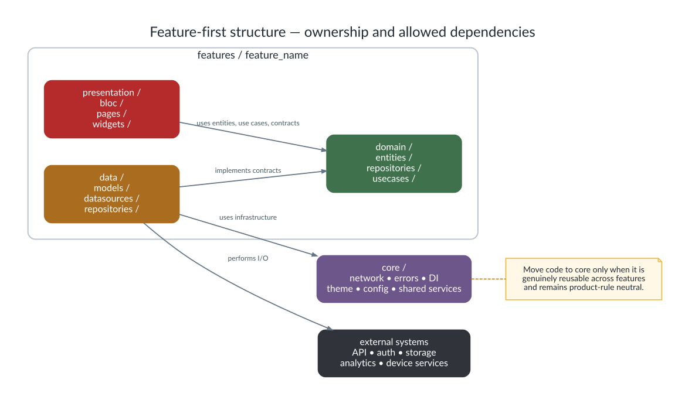<figcaption></figcaption></figure>

_Figure 3. Feature-first folder ownership and allowed dependency direction._

<details>

<summary>Editable Mermaid source</summary>

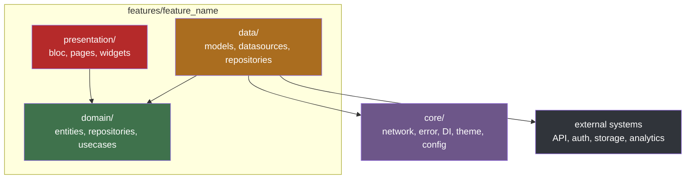

</details>

### 7.1 Standard structure

```
lib/
  core/
    config/
    di/
    error/
    network/
    services/
    storage/
    theme/
    utils/
  features/
    <feature_name>/
      data/
        datasources/
          <feature>_remote_datasource.dart
          <feature>_local_datasource.dart
        models/
          <feature>_dto.dart
        repositories/
          <feature>_repository_impl.dart
      domain/
        entities/
          <feature>.dart
        repositories/
          <feature>_repository.dart
        usecases/
          get_<feature>.dart
          submit_<feature>.dart
      presentation/
        bloc/
          <feature>_bloc.dart
          <feature>_event.dart
          <feature>_state.dart
        pages/
        widgets/
```

### 7.2 When code belongs in `core`

Move code to `core` only when all are true:

* it is used by more than one feature or is an application-wide concern;
* its behaviour is generic and not tied to one product capability;
* moving it does not create hidden dependencies between features;
* its ownership and test coverage remain clear.

A helper used once is not automatically shared code. Prematurely moving code to `core` often creates generic names and weak ownership.

### 7.3 Avoid barrel files by default

Barrel files can shorten imports, but large barrels hide dependencies and can increase accidental coupling. Use them only when a small, stable public surface is intentionally being exposed. Internal feature files should usually import the exact file they need.

***

## 8. General coding practices

This section defines the everyday practices that make the architecture readable and maintainable.

### 8.1 Optimise for the next reader

Most code is read more often than it is written. The next reader may be:

* a junior developer learning the feature;
* a reviewer checking a production fix;
* a QA engineer investigating a state mismatch;
* the original author returning after six months.

Prefer code that communicates intent directly. Avoid requiring the reader to mentally execute several transformations just to understand a name or condition.

### 8.2 Use `final` by default

A local variable or field SHOULD be `final` when it is assigned once. This reduces accidental reassignment and makes the data flow easier to follow.

```dart
final employeeId = employee.id;
final isDelegationActive = employee.isDelegationActiveAt(clock.now());
```

Use `var` only when the inferred type is obvious and the variable is still not reassigned. Avoid `dynamic` unless crossing a genuinely dynamic boundary, and convert it into a typed structure immediately.

### 8.3 Use `const` when the value is compile-time constant

`const` documents that an object is canonical and immutable at compile time. In Flutter, const widgets can also reduce unnecessary object creation.

```dart
const SizedBox(height: 16);
const EdgeInsets.all(8);
```

Do not add `const` mechanically when it reduces readability or cannot be maintained because inputs are runtime values.

### 8.4 Prefer guard clauses

Guard clauses keep the main success path less indented.

```dart
Future<void> _onApprove(
  ApproveRequestEvent event,
  Emitter<ApprovalState> emit,
) async {
  final request = state.requestOrNull;
  if (request == null) {
    emit(const ApprovalState.error('No request is loaded.'));
    return;
  }

  emit(ApprovalState.submitting(request));
  // Continue with the normal path.
}
```

Deeply nested `if` statements usually indicate that validation, branching, or extraction into smaller functions is needed.

### 8.5 Keep one level of abstraction per function

A function should not mix high-level business decisions with low-level string parsing, storage calls, and UI messages.

Poorly mixed function:

```dart
Future<void> submit() async {
  final token = await storage.read(key: 'token');
  final json = await dio.post('/leave', data: form.toJson());
  final days = calculateWorkingDays(...);
  showDialog(...);
}
```

Preferred separation:

```dart
Future<void> _submitLeaveRequest(
  SubmitLeaveRequestEvent event,
  Emitter<LeaveState> emit,
) async {
  emit(LeaveState.submitting(state.currentForm));

  final result = await submitLeaveRequest(event.request);

  result.match(
    (failure) => emit(LeaveState.submissionError(
      form: state.currentForm,
      message: failure.userMessage,
    )),
    (request) => emit(LeaveState.submitted(request)),
  );
}
```

### 8.6 Keep functions focused

A function SHOULD have one reason to change. A long function is not always wrong, but length often reveals multiple responsibilities.

Extract a function when it:

* has a name that explains a meaningful sub-step;
* is reusable or independently testable;
* removes deeply nested logic;
* separates policy from mechanics;
* makes the main flow read like a sequence of actions.

Do not extract every two lines into a method. Tiny methods with vague names can make code harder to trace.

### 8.7 Avoid hidden mutation

A function that looks like a query should not unexpectedly change state.

```dart
// Misleading: sounds like a query but mutates the list.
Employee? findPrimaryDelegate(List<Employee> delegates) {
  delegates.sort((a, b) => a.rank.compareTo(b.rank));
  return delegates.firstOrNull;
}
```

Prefer a non-mutating copy:

```dart
Employee? findPrimaryDelegate(List<Employee> delegates) {
  final orderedDelegates = [...delegates]
    ..sort((a, b) => a.rank.compareTo(b.rank));

  return orderedDelegates.firstOrNull;
}
```

Or place the ordering in a dedicated policy that returns a new collection.

### 8.8 Avoid magic values

Use named constants, enums, configuration, or value objects instead of unexplained strings and numbers.

```dart
const catalogCacheTtl = Duration(days: 7);
const annualLeaveTypeId = '432';
```

A constant name should explain why the value exists, not merely repeat the value.

### 8.9 Prefer enums or sealed types over string status values

```dart
enum RequestStatus {
  draft,
  pendingApproval,
  approved,
  declined,
  cancelled,
}
```

If the backend returns a string, parse it once in the DTO or mapper. Unknown values should have an explicit fallback or produce a controlled mapping failure.

### 8.10 Use named parameters for clarity

Use named parameters when:

* a function accepts more than one value of the same type;
* booleans would otherwise be positional;
* the call site benefits from domain language;
* optional values exist.

```dart
final period = DelegationPeriod(
  startsOn: awayFrom,
  endsOn: awayUntil,
);
```

Avoid:

```dart
final period = DelegationPeriod(awayFrom, awayUntil, true);
```

### 8.11 Avoid positional booleans

A call such as `loadData(true, false)` is not self-explanatory. Use named parameters or separate methods.

```dart
await loadData(
  forceRefresh: true,
  allowCacheFallback: false,
);
```

### 8.12 Keep public APIs typed and explicit

Public methods, repository contracts, use cases, and shared helpers SHOULD declare return types and parameter types. Do not expose `Map<String, dynamic>` when a domain type can represent the value.

### 8.13 Use null to mean one clear thing

Nullable fields should represent a meaningful absence, such as “no manager assigned” or “approval date not available”. Do not use null as a general error signal, loading signal, or unknown state when a sealed type would be clearer.

### 8.14 Avoid excessive `late`

Use `late` only when lifecycle ownership guarantees initialization before access. Prefer constructor injection, nullable state, or a `late final` field with a clear lifecycle.

`late` can convert a compile-time safety check into a runtime failure. It should not be used merely to silence the analyzer.

### 8.15 Avoid force-unwrapping unless the invariant is local and proven

The null assertion operator (`!`) is acceptable when the same function has just established the invariant. It is risky when the invariant depends on another screen, asynchronous timing, or backend behaviour.

Prefer explicit validation and controlled failure.

### 8.16 Treat generated files as generated

Do not manually edit `*.freezed.dart`, `*.g.dart`, or other generated output. Update the source annotation and rerun code generation.

Generated files SHOULD be committed or excluded according to the team's agreed build strategy. Whichever strategy is chosen, CI must be able to reproduce the build reliably.

### 8.17 Format and analyse before review

At minimum, a change SHOULD pass:

```bash
dart format .
flutter analyze
flutter test
```

Feature-specific integration tests and generation commands should be included where relevant.

***

## 9. Naming standards

Names should make the code read like a technical description of the business behaviour.

### 9.1 General rules

* Use **UpperCamelCase** for classes, enums, extensions, typedefs, and mixins.
* Use **lowerCamelCase** for variables, parameters, functions, methods, and properties.
* Use **snake\_case** for file and directory names.
* Use full words unless an abbreviation is universally understood in the codebase or business domain.
* Keep one term for one concept. Do not alternate between `customer`, `client`, and `consumer` unless they are genuinely different roles.

### 9.2 Variable names

A variable name should describe the value and, when useful, its unit or state.

Good:

```dart
final approvedLeaveDays = leaveBalance.approvedDays;
final cacheExpiresAt = cachedCatalog.savedAt.add(catalogCacheTtl);
final isCurrentEmployee = employee.id == currentEmployeeId;
```

Poor:

```dart
final x = leaveBalance.approvedDays;
final date = cachedCatalog.savedAt.add(ttl);
final check = employee.id == id;
```

#### Include units where ambiguity exists

Use names such as:

* `timeoutSeconds`
* `fileSizeBytes`
* `distanceMeters`
* `cacheAgeDays`
* `retryDelay`

A `Duration` usually communicates its unit through the type, so `requestTimeout` is sufficient.

#### Collection names should be plural

```dart
final employees = <Employee>[];
final policiesById = <String, Policy>{};
final selectedEmployeeIds = <String>{};
```

### 9.3 Boolean names

Boolean names SHOULD read as questions or predicates:

* `isLoading`
* `hasPermission`
* `canApprove`
* `shouldRefresh`
* `wasSubmitted`
* `requiresAttachment`

Prefer positive names. `isEnabled` is easier to reason about than `isNotDisabled`.

Avoid names such as `flag`, `status`, or `check` when the type is boolean.

### 9.4 Function and method names

Functions that perform actions should begin with a verb:

* `loadPolicies`
* `submitLeaveRequest`
* `mapFailureToMessage`
* `calculateWorkingDays`
* `isDelegationActiveAt`
* `findAvailableDelegate`

The name should describe the observable result rather than implementation details. Prefer `loadEmployeeProfile` over `callEmployeeEndpoint`.

#### Commands and queries

A **query** returns information and should not produce surprising mutation:

```dart
bool isDelegationActiveAt(DateTime date)
Employee? findAvailableDelegate(List<Employee> delegates)
```

A **command** changes state or performs an external effect:

```dart
Future<Either<Failure, Unit>> assignDelegate()
Future<Either<Failure, Policy>> acknowledgePolicy(String acknowledgementId)
```

### 9.5 Class names

Classes should normally be nouns or noun phrases:

* `Employee`
* `DelegationPeriod`
* `PoliciesRepository`
* `SubmitLeaveRequest`
* `ProfilePhotoRemoteDatasource`
* `FailureMapper`

Avoid vague names such as `Manager`, `Helper`, `Utils`, `Processor`, or `Handler` unless the responsibility is made specific, for example `DeepLinkHandler` or `CurrencyFormatter`.

### 9.6 File names

| Item                      | Pattern                                          | Example                                |
| ------------------------- | ------------------------------------------------ | -------------------------------------- |
| Domain entity             | business noun                                    | `employee.dart`                        |
| Repository contract       | `<feature>_repository.dart`                      | `policies_repository.dart`             |
| Repository implementation | `<feature>_repository_impl.dart`                 | `policies_repository_impl.dart`        |
| Remote data source        | `<feature>_remote_datasource.dart`               | `announcements_remote_datasource.dart` |
| DTO                       | `<entity>_dto.dart`                              | `employee_dto.dart`                    |
| Use case                  | verb + noun                                      | `submit_leave_request.dart`            |
| BLoC                      | `<feature>_bloc.dart`                            | `leave_bloc.dart`                      |
| Event                     | `<feature>_event.dart`                           | `leave_event.dart`                     |
| State                     | `<feature>_state.dart`                           | `leave_state.dart`                     |
| Page                      | `<feature>_page.dart` or `<feature>_screen.dart` | `leave_application_page.dart`          |
| Reusable widget           | descriptive noun                                 | `approval_action_card.dart`            |

Use either `Page` or `Screen` consistently within a project unless the team intentionally differentiates them.

### 9.7 BLoC event names

Events should represent user or system intent in the past/present action form agreed by the team. Examples:

* `LoadPoliciesEvent`
* `RefreshPoliciesEvent`
* `AcknowledgePolicyEvent`
* `ProfilePhotoSelected`
* `ApprovalSubmitted`

Do not name events after widgets, such as `ButtonClicked`, unless the exact button has domain meaning. `ApproveRequestEvent` is clearer than `GreenButtonPressedEvent`.

### 9.8 BLoC state names

States should describe the feature condition:

* `PoliciesInitial`
* `PoliciesLoading`
* `PoliciesLoaded`
* `PolicyAcknowledging`
* `PolicyAcknowledged`
* `PoliciesError`
* `PolicyAcknowledgeError`

When using Freezed unions, constructor names may be shorter because the containing type supplies context:

```dart
const factory PoliciesState.loading() = PoliciesLoading;
const factory PoliciesState.loaded(List<Policy> policies) = PoliciesLoaded;
```

### 9.9 Test names

Test names should describe behaviour, not implementation.

```dart
test(
  'returns cached catalog when cache is valid',
  () async { ... },
);
```

For complex cases, use a Given-When-Then structure in the name or test body:

```dart
blocTest<PoliciesBloc, PoliciesState>(
  'emits loading then loaded when policies are returned',
  build: () => bloc,
  act: (bloc) => bloc.add(const LoadPoliciesEvent()),
  expect: () => [
    const PoliciesState.loading(),
    PoliciesState.loaded(policies),
  ],
);
```

***

## 10. Immutability and Freezed standards

Immutability means that an object's observable state cannot be changed after construction. Instead of changing an existing value, code creates a new value.

Immutability is the default for:

* domain entities and value objects;
* BLoC events and states;
* request parameter objects;
* DTOs and cache records;
* configuration values.

### 10.1 Why immutability matters

Immutability provides:

* predictable state transitions;
* safer asynchronous code;
* reliable equality for tests and rebuild decisions;
* easier debugging because previous values do not change underneath the reader;
* safer collection sharing;
* simpler undo, history, and event logging;
* fewer accidental side effects.

### 10.2 Plain Dart immutable class

Use `final` fields and a `const` constructor where possible.

```dart
@immutable
final class DelegationPeriod {
  const DelegationPeriod({
    required this.startsOn,
    required this.endsOn,
  });

  final DateTime startsOn;
  final DateTime endsOn;

  bool contains(DateTime date) {
    final day = DateTime(date.year, date.month, date.day);
    final start = DateTime(startsOn.year, startsOn.month, startsOn.day);
    final end = DateTime(endsOn.year, endsOn.month, endsOn.day);

    return !day.isBefore(start) && !day.isAfter(end);
  }
}
```

### 10.3 Freezed entity standard

Freezed is recommended when an immutable class benefits from generated equality, `copyWith`, JSON integration, default values, or sealed unions.

```dart
import 'package:freezed_annotation/freezed_annotation.dart';

part 'employee.freezed.dart';

@freezed
sealed class Employee with _$Employee {
  const Employee._();

  const factory Employee({
    required String id,
    required String name,
    required String email,
    @Default('') String role,
    @Default('') String department,
    DateTime? awayFrom,
    DateTime? awayUntil,
    @Default(<EmployeeReport>[]) List<EmployeeReport> directReports,
  }) = _Employee;

  bool isDelegationActiveAt(DateTime date) {
    final start = awayFrom;
    final end = awayUntil;

    if (start == null || end == null) {
      return false;
    }

    final day = DateTime(date.year, date.month, date.day);
    final startDay = DateTime(start.year, start.month, start.day);
    final endDay = DateTime(end.year, end.month, end.day);

    return !day.isBefore(startDay) && !day.isAfter(endDay);
  }
}
```

#### Why `const Employee._()` exists

A private constructor allows custom getters and methods to be added to a Freezed class while keeping generated immutable constructors.

### 10.4 Freezed state union standard

Use sealed unions when states are mutually exclusive.

```dart
part 'policies_state.freezed.dart';

@freezed
sealed class PoliciesState with _$PoliciesState {
  const factory PoliciesState.initial() = PoliciesInitial;
  const factory PoliciesState.loading() = PoliciesLoading;
  const factory PoliciesState.loaded({
    required List<Policy> policies,
  }) = PoliciesLoaded;
  const factory PoliciesState.acknowledging({
    required List<Policy> policies,
    required String policyId,
  }) = PolicyAcknowledging;
  const factory PoliciesState.acknowledged({
    required List<Policy> policies,
    required String policyId,
  }) = PolicyAcknowledged;
  const factory PoliciesState.error({
    required String message,
  }) = PoliciesError;
}
```

This prevents impossible combinations such as `isLoading == true`, `hasError == true`, and `data == null` without a clear meaning.

### 10.5 Update state with `copyWith` or a new union case

Do not mutate state collections or fields.

```dart
emit(
  currentState.copyWith(
    selectedEmployeeId: event.employeeId,
  ),
);
```

For mutually exclusive journeys, emit a new union case:

```dart
emit(PoliciesState.acknowledging(
  policies: currentPolicies,
  policyId: event.policyId,
));
```

### 10.6 Collection immutability

Never modify a list held by an existing state.

Incorrect:

```dart
state.employees.add(newEmployee);
emit(state);
```

Correct:

```dart
emit(
  state.copyWith(
    employees: [...state.employees, newEmployee],
  ),
);
```

When accepting a collection into a hand-written immutable class, create an unmodifiable copy if callers could retain and mutate the original list.

```dart
EmployeeGroup(List<Employee> employees)
    : employees = List.unmodifiable(employees);
```

### 10.7 Do not use mutable controllers as domain fields

Objects such as `TextEditingController`, `ScrollController`, `AnimationController`, and `BuildContext` belong to the presentation lifecycle. They must not be stored in domain entities, repository parameters, or BLoC state.

BLoC state should contain the underlying text or selection, not the UI controller.

### 10.8 Date and time immutability

`DateTime` is immutable, but direct use of `DateTime.now()` inside business rules makes tests time-dependent. Inject a clock or pass the date into the method.

```dart
abstract interface class Clock {
  DateTime now();
}

final class SystemClock implements Clock {
  const SystemClock();

  @override
  DateTime now() => DateTime.now();
}
```

This allows tests to use a fixed clock.

### 10.9 When not to use Freezed

Freezed is not mandatory for every tiny private helper. A plain Dart record, enum, or small immutable class may be simpler when:

* generated equality is unnecessary;
* no JSON or `copyWith` support is needed;
* the type is private and local;
* a value can be represented clearly by a record.

Use Freezed because it improves correctness and clarity, not merely because it exists in the project.

***

## 11. Function and class design

### 11.1 Single responsibility

A class should have one primary reason to change.

* `PoliciesRemoteDatasource` changes when API integration changes.
* `PoliciesRepositoryImpl` changes when source-selection or mapping rules change.
* `AcknowledgePolicy` changes when the business action changes.
* `PoliciesBloc` changes when the UI journey changes.

If a class handles authentication, analytics, cache, navigation, and feature rules, it is probably a hidden service locator or mega-service.

### 11.2 Prefer composition over inheritance

Use inheritance for true subtype relationships and framework contracts. Use composition to assemble behaviour.

Prefer:

```dart
final class PoliciesRepositoryImpl implements PoliciesRepository {
  PoliciesRepositoryImpl({
    required this.remoteDatasource,
    required this.failureMapper,
  });

  final PoliciesRemoteDatasource remoteDatasource;
  final FailureMapper failureMapper;
}
```

Over a deep hierarchy of base repositories that hide network and error behaviour.

### 11.3 Use interfaces at meaningful boundaries

Repository contracts and external service adapters are meaningful interfaces because they isolate technology and support testing.

Avoid creating an interface for every class by habit. An interface adds value when multiple implementations, substitution, isolation, or a stable boundary is expected.

Modern Dart class modifiers can make intent explicit:

```dart
abstract interface class PoliciesRepository {
  Future<Either<Failure, List<Policy>>> getPolicies();
}
```

### 11.4 Parameter objects

When a use case requires several values, use an immutable parameter object.

```dart
@freezed
sealed class SubmitLeaveRequestParams with _$SubmitLeaveRequestParams {
  const factory SubmitLeaveRequestParams({
    required String leaveTypeId,
    required DateTime startDate,
    required DateTime endDate,
    String? reason,
    String? attachmentPath,
  }) = _SubmitLeaveRequestParams;
}
```

This prevents positional mistakes and allows the action to evolve without a long parameter list.

### 11.5 Value objects for important concepts

A primitive type does not always communicate business meaning. Consider a value object when validation or behaviour belongs to a concept.

Examples:

* `EmailAddress`
* `EmployeeId`
* `Money`
* `LeaveDays`
* `DelegationRank`
* `DateRange`

Do not wrap every string. Use value objects where they protect an invariant or prevent confusion.

### 11.6 Avoid static mutable state

Static mutable values create hidden shared state and make tests order-dependent. Prefer constructor-injected services or application-scoped objects managed by DI.

Static pure helpers and constants are acceptable when they have no mutable state or hidden dependencies.

### 11.7 Separate policy from mechanism

Policy answers _what should happen_. Mechanism answers _how it is performed_.

Example:

* `DelegateSelectionPolicy` decides which available manager has the highest priority.
* `DelegationRemoteDatasource` sends the assignment request.

Keeping them separate allows the selection rule to be tested without a network call.

### 11.8 Avoid catch-all utility classes

Instead of:

```dart
class AppUtils {
  static String formatDate(...)
  static bool validateEmail(...)
  static Future<File> compressImage(...)
  static int calculateLeaveDays(...)
}
```

Prefer focused units:

* `AppDateFormatter`
* `EmailAddress` value object
* `ImageCompressor`
* `LeaveDayCalculator`

### 11.9 Document non-obvious invariants

Comments should explain why a constraint exists.

```dart
// Approval commands remain online-only because stale approval state can
// cause duplicate or conflicting decisions across approvers.
```

Avoid comments that merely repeat the code.

***

## 12. BLoC and state-management standards

### 12.1 Keep builders pure

`BlocBuilder` and `builder` functions may run many times. They should return widgets from state and avoid side effects.

Use `BlocListener` for:

* navigation;
* dialogs;
* snackbars and toasts;
* launching external actions;
* one-time success feedback.

### 12.2 Do not call use cases from widgets

Widgets dispatch intent. BLoC/Cubit calls use cases. This keeps loading, error, retry, and concurrency behaviour in one testable location.

### 12.3 Model states around the user journey

State should answer what the UI needs to render now.

Good state modelling includes:

* initial;
* loading;
* loaded with required data;
* empty when meaningful;
* submitting while current content remains available;
* command success;
* command-specific error;
* fatal loading error.

### 12.4 Preserve loaded data during commands

When a command starts from a loaded screen, preserve the loaded data in the processing state.

```dart
const factory LeaveState.submitting({
  required LeaveFormData form,
  required List<LeaveBalance> balances,
}) = LeaveSubmitting;
```

This allows the UI to show an overlay instead of becoming blank.

### 12.5 Use event concurrency deliberately

Events can overlap. The chosen behaviour must match the user journey.

* **Sequential**: complete events in order; useful for commands that must not overlap.
* **Restartable**: cancel the previous logical result when a new search or filter event arrives.
* **Droppable**: ignore repeated taps while an existing submission is in progress.
* **Concurrent**: allow independent work to run together only when state updates cannot conflict.

Document non-default event transformers because they affect observable behaviour.

### 12.6 Prevent duplicate commands

Disable the action in the UI and protect the BLoC/repository from duplicate execution. UI disabling alone is insufficient because events can be dispatched programmatically or by rapid interaction.

### 12.7 Keep validation ownership clear

* Immediate visual input rules may be checked in the presentation layer.
* Reusable business validation belongs in value objects, domain services, or use cases.
* Backend validation remains authoritative and must map into typed failures.

Do not duplicate a complex rule independently in the widget and use case. Extract it into a shared pure domain policy.

### 12.8 State equality

States must have reliable value equality so that tests and rebuild behaviour are predictable. Freezed provides generated equality; hand-written states should implement equality deliberately.

### 12.9 Selective rebuilds

Use `buildWhen`, `BlocSelector`, or smaller widgets when a large state causes unrelated parts of the screen to rebuild frequently. Optimise after understanding the state shape; do not fragment the UI prematurely.

### 12.10 BLoC error handling

A BLoC should not catch `Exception` merely to produce a generic string if the repository contract already returns `Failure`. Unexpected exceptions may still be caught at a protective boundary, logged, and converted to an unknown failure, but expected failures should be typed.

***

## 13. DTO, entity, mapping, and serialization standards

### 13.1 Domain entity versus DTO

A DTO mirrors external data. A domain entity represents application meaning.

DTO:

```dart
@freezed
sealed class EmployeeDto with _$EmployeeDto {
  const factory EmployeeDto({
    @JsonKey(name: 'employeeId') required String id,
    @Default('') String name,
    @Default('') String email,
    EmployeeReportDto? reportTo,
  }) = _EmployeeDto;

  factory EmployeeDto.fromJson(Map<String, dynamic> json) =>
      _$EmployeeDtoFromJson(json);
}
```

Domain entity:

```dart
@freezed
sealed class Employee with _$Employee {
  const factory Employee({
    required String id,
    required String name,
    required String email,
    EmployeeReport? reportTo,
  }) = _Employee;
}
```

Mapping:

```dart
extension EmployeeDtoMapper on EmployeeDto {
  Employee toDomain() {
    return Employee(
      id: id,
      name: name.trim(),
      email: email.trim(),
      reportTo: reportTo?.toDomain(),
    );
  }
}
```

### 13.2 Do not leak backend field names

Names such as `employeeId`, `txtEmployeeName`, or `outputParameters` may be correct for transport, but they should not shape UI and domain code unless they are also the approved business language.

### 13.3 Parse tolerant input at the boundary

External systems may omit optional values or return inconsistent shapes. Handle tolerated variations in the DTO/data-source layer, not throughout the application.

When a required invariant is missing, return a mapping or server failure rather than constructing a misleading domain object.

### 13.4 Defaults must be intentional

`@Default('')` prevents null errors, but an empty string may hide invalid backend data. Use defaults only when an empty value is meaningful and the UI can safely represent it.

For required business values, prefer a controlled mapping failure.

### 13.5 Date parsing

Parse dates once at the boundary. Domain entities should normally hold `DateTime` or a value object, not raw date strings.

Clarify whether a value is:

* an instant with timezone;
* a local date without time;
* a local date and time;
* a server-specific format.

Do not compare date-only concepts using timestamps without normalising them.

### 13.6 Mapping tests

Mappers SHOULD test:

* complete valid payload;
* optional fields missing;
* empty collections;
* nested object variations;
* unknown enum/status values;
* malformed required values;
* timezone/date conversion.

### 13.7 Serialization ownership

Only DTOs, cache records, and data-layer models should normally contain `fromJson`, `toJson`, or JSON annotations. Domain entities remain independent unless the team has explicitly accepted domain serialization for a specific reason.

***

## 14. Dependency injection and configuration

### 14.1 Register from infrastructure inward

A typical order is:

1. configuration and shared infrastructure;
2. remote and local data sources;
3. repository implementations registered against domain contracts;
4. use cases;
5. BLoC/Cubit factories.

```dart
sl
  ..registerLazySingleton<PoliciesRemoteDatasource>(
    () => PoliciesRemoteDatasourceImpl(httpHelper: sl()),
  )
  ..registerLazySingleton<PoliciesRepository>(
    () => PoliciesRepositoryImpl(remoteDatasource: sl()),
  )
  ..registerLazySingleton(
    () => GetPolicies(repository: sl()),
  )
  ..registerFactory(
    () => PoliciesBloc(getPolicies: sl()),
  );
```

### 14.2 Use factories for screen-scoped state

BLoCs and Cubits are normally factories unless the state is intentionally application-scoped. A singleton BLoC can preserve stale state and listeners across unrelated screens.

### 14.3 Avoid service-locator calls deep in widgets

Prefer dependency provision at the route or feature entry point.

```dart
BlocProvider(
  create: (_) => sl<PoliciesBloc>()
    ..add(const LoadPoliciesEvent()),
  child: const PoliciesPage(),
)
```

The page should consume `PoliciesBloc` through context rather than resolving repositories or services itself.

### 14.4 Environment configuration

URLs, feature flags, timeouts, environment names, and analytics keys must not be scattered as literals in feature code. Resolve them through configuration objects.

Secrets must never be committed in source code. Build-time values still need secure handling in CI/CD and platform configuration.

### 14.5 Dependency lifetime

| Dependency                        | Typical lifetime                             |
| --------------------------------- | -------------------------------------------- |
| Stateless HTTP helper/interceptor | lazy singleton                               |
| Remote/local data source          | lazy singleton                               |
| Repository implementation         | lazy singleton                               |
| Pure use case                     | lazy singleton or factory                    |
| Screen BLoC/Cubit                 | factory                                      |
| Authenticated app-session state   | carefully managed application scope          |
| UI controller                     | widget lifecycle, never global DI by default |

***

## 15. Error handling, observability, and security

### 15.1 Failure mapping pattern

```
RemoteDataSource
  -> throws or returns technical API/transport error
RepositoryImpl
  -> catches expected technical error
  -> maps to Failure.network / server / validation / unauthorized / notFound
UseCase
  -> returns Either<Failure, DomainResult>
BLoC
  -> emits loaded / error / submissionError
UI
  -> shows retry, inline message, dialog, toast, or route action
```

### 15.2 Typed failures

Failures should help the app decide what to do, not only display text.

```dart
@freezed
sealed class Failure with _$Failure {
  const factory Failure.network({String? message}) = NetworkFailure;
  const factory Failure.server({String? message, int? statusCode}) = ServerFailure;
  const factory Failure.validation({
    required Map<String, String> fieldErrors,
    String? message,
  }) = ValidationFailure;
  const factory Failure.unauthorized({String? message}) = UnauthorizedFailure;
  const factory Failure.notFound({String? message}) = NotFoundFailure;
  const factory Failure.unknown({String? message}) = UnknownFailure;
}
```

Do not expose raw server stack traces or transport messages directly to users.

### 15.3 Logging

Logs should answer what happened without exposing secrets.

Include when appropriate:

* feature/action name;
* correlation ID;
* non-sensitive entity identifier;
* duration;
* failure category;
* environment and app version.

Do not log:

* access or refresh tokens;
* passwords, OTPs, or biometric data;
* complete personal records;
* confidential attachments;
* raw request/response bodies containing personal information.

### 15.4 Analytics

Use a wrapper in core infrastructure. Feature code should send business-level events, not vendor-specific calls.

```dart
analytics.track(
  const AnalyticsEvent.policyAcknowledged(),
);
```

Event naming and properties should be documented, versioned, and privacy-reviewed.

### 15.5 Correlation IDs

Where supported, propagate correlation or trace identifiers through the HTTP layer and include them in safe diagnostic logs. This enables backend and mobile teams to investigate one transaction across systems.

### 15.6 Secure storage

Tokens and sensitive session values belong in platform-backed secure storage. Ordinary preferences or cache are not appropriate for secrets.

The application should define:

* when secrets are written;
* when they are rotated;
* what logout clears;
* behaviour when secure storage is unavailable or corrupted;
* whether screenshots, clipboard, or backups require restrictions.

### 15.7 Input and output safety

* Validate file type, size, and extension before upload.
* Treat backend-provided URLs as untrusted input and allow only approved schemes.
* Escape or safely render rich text and HTML.
* Avoid exposing sensitive values in exception strings.
* Do not rely on client-side validation as a security control.

### 15.8 Unexpected errors

A global error boundary may record unexpected failures and show a safe fallback. It must not replace local failure handling for expected network, validation, authorization, and business outcomes.

***

## 16. Flutter UI, accessibility, and responsive design

### 16.1 Keep pages thin

A page coordinates layout and providers. Extract widgets when they have a clear visual responsibility, reusable behaviour, or independent rebuild boundary.

Prefer names such as:

* `ProfileHeaderSection`
* `ApprovalActionCard`
* `LeaveBalanceSummary`
* `PolicyAcknowledgementButton`

Avoid generic names such as `CustomWidget`, `CommonCard`, or `ItemView` without context.

### 16.2 Do not perform expensive work in `build`

The `build` method may run frequently. Avoid:

* sorting or filtering large lists repeatedly;
* parsing JSON;
* file I/O;
* network requests;
* expensive date calculations;
* creating controllers on every build.

Prepare values in state, selectors, memoised pure helpers, or lifecycle methods as appropriate.

### 16.3 Use the correct list widget

Use lazy builders such as `ListView.builder` or slivers for long or dynamic collections. Avoid placing a large generated list of children inside a `Column` or `SingleChildScrollView`.

### 16.4 Responsive layout

Design for constraints rather than one device size.

* Use `LayoutBuilder` or responsive breakpoints when layout structure changes.
* Avoid fixed widths that assume one screen.
* Respect safe areas, keyboard insets, text scaling, and orientation.
* Test compact phones, large phones, and supported tablets/web sizes.

### 16.5 Accessibility

Critical controls MUST have meaningful labels and adequate target size. Test with screen readers and large text.

Consider:

* `Semantics` labels for icons and custom controls;
* logical focus order;
* accessible error messages;
* sufficient colour contrast;
* not using colour as the only status indicator;
* text alternatives for meaningful images;
* minimum interactive target sizes;
* dynamic text scaling without clipping.

### 16.6 Localisation

User-facing text should come from localisation resources where the application supports multiple locales. Do not concatenate translated fragments in a way that assumes English word order.

Dates, numbers, currencies, and plural forms should use locale-aware formatting.

### 16.7 Stable test keys

Add stable keys to critical screens and interactions:

```dart
const Key('leave_application_screen')
const Key('leave_submit_button')
const Key('approval_approve_button')
```

Keys should describe purpose and remain stable when visible text or layout changes.

### 16.8 Navigation

Navigation is a presentation concern. Business use cases should not receive `BuildContext` or route names.

Use listeners or route-level coordinators for navigation after state changes. Avoid navigating before a command confirms success.

***

## 17. Performance and reliability

### 17.1 Measure before optimising

Use Flutter DevTools, traces, logs, and controlled tests to identify the real bottleneck. Avoid speculative complexity.

### 17.2 Common performance practices

* Use const widgets where practical.
* Split rebuild boundaries when state changes are local.
* Use lazy lists for large collections.
* Resize and cache images appropriately.
* Avoid synchronous heavy computation on the UI isolate.
* Debounce or restart search requests.
* Paginate large remote datasets.
* Avoid repeated parsing and mapping of unchanged payloads.
* Dispose controllers, subscriptions, and focus nodes owned by widgets.

### 17.3 Heavy computation

Large parsing, image processing, encryption, or calculation work may block the UI isolate. Move sufficiently heavy pure computation to an isolate or appropriate platform service. Measure the transfer overhead; not every small calculation needs an isolate.

### 17.4 Network reliability

Retries must be safe and bounded.

* Retry transient idempotent reads with backoff when approved.
* Do not automatically retry non-idempotent commands unless the API supports idempotency keys or equivalent guarantees.
* Distinguish timeout, offline, unauthorized, server, and validation failures.
* Prevent multiple identical in-flight requests when possible.

### 17.5 Cancellation and stale results

Search, filters, and rapid navigation can create stale responses. Use restartable event handling, request identity, or state guards so an old response does not overwrite a newer selection.

### 17.6 Resource ownership

Every resource should have a clear owner and disposal point:

* widgets own UI controllers and dispose them;
* BLoCs own stream subscriptions they create and cancel them in `close`;
* repositories own no UI lifecycle resources;
* application-scoped services define shutdown/reset behaviour if necessary.

***

## 18. Testing strategy and quality gates

<figure>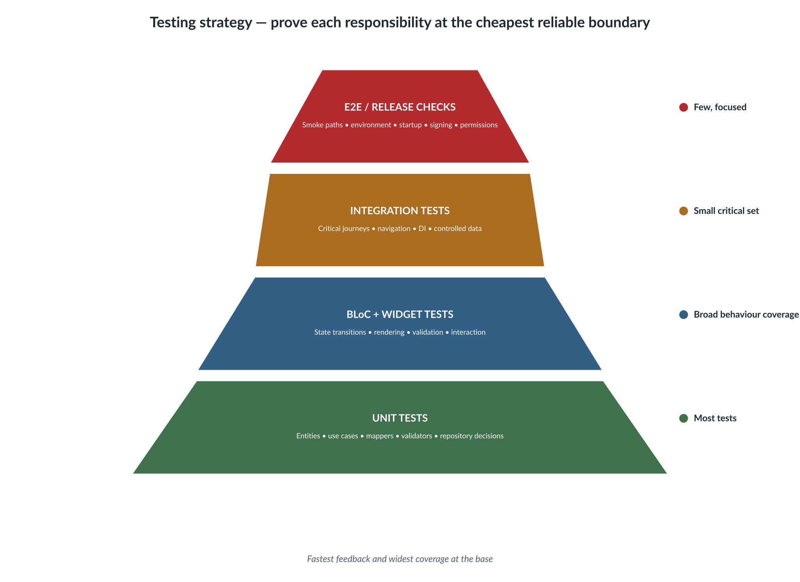<figcaption></figcaption></figure>

_Figure 4. Testing strategy and quality-gate pyramid._

<details>

<summary>Editable Mermaid source</summary>

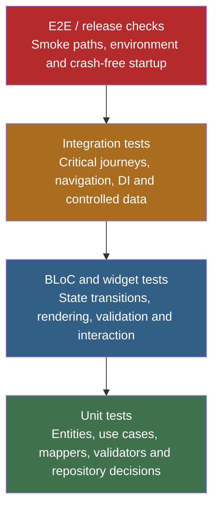

</details>

The goal is not to test every behaviour through an emulator. Test each responsibility at the cheapest reliable boundary.

### 18.1 Unit tests

Unit tests cover:

* entity and value-object rules;
* use cases;
* validation policies;
* date calculations;
* DTO mappers;
* repository cache decisions;
* failure mapping;
* pure formatters where behaviour is non-trivial.

Unit tests should be fast, deterministic, and independent of Flutter rendering or live services.

### 18.2 Repository tests

Repository tests SHOULD verify:

* remote success mapping;
* network/server exception mapping;
* valid cache path;
* stale cache path;
* missing or corrupt cache;
* cache write behaviour;
* fallback rules;
* online-only command behaviour;
* unauthorized handling.

### 18.3 BLoC tests

BLoC tests cover event-to-state transitions:

* loading before data arrives;
* loaded/empty/error result;
* submission state preserving current data;
* command success and failure;
* duplicate-tap protection;
* refresh and retry;
* event-concurrency behaviour.

### 18.4 Widget tests

Widget tests cover:

* rendering for each important state;
* enabled/disabled actions;
* validation messages;
* empty and error views;
* tap and input behaviour;
* listeners that show feedback or navigation where practical;
* accessibility labels and test keys.

### 18.5 Integration tests

Integration tests cover a small set of critical user journeys through the real app shell:

* app startup and dependency injection;
* onboarding/login path;
* navigation to a feature;
* a critical successful command;
* an important failure/retry case where feasible;
* platform integration that cannot be proven lower in the pyramid.

Use stable keys and controlled test data. Avoid depending on unpredictable production data.

### 18.6 Release checks

Release checks include:

* correct flavour, application ID, signing, and environment;
* startup without DI or generated-code failures;
* crash reporting and analytics sanity;
* permissions and deep links;
* secure-storage/session behaviour;
* supported OS/device smoke coverage;
* performance checks for critical screens;
* accessibility smoke checks.

### 18.7 Test data builders

Use factories or builders to keep test setup readable.

```dart
Employee buildEmployee({
  String id = 'employee-1',
  String name = 'Test Employee',
  DateTime? awayFrom,
  DateTime? awayUntil,
}) {
  return Employee(
    id: id,
    name: name,
    email: 'test@example.com',
    awayFrom: awayFrom,
    awayUntil: awayUntil,
  );
}
```

Avoid sharing mutable fixture objects between tests.

### 18.8 Quality gates before merge

A feature SHOULD NOT merge until:

* formatting and analyzer checks pass;
* generated files are current;
* unit and BLoC tests pass;
* critical widget and integration coverage is updated;
* no presentation file imports DTOs, data sources, HTTP helpers, or storage implementations;
* errors are mapped to typed failures;
* cache behaviour is documented and tested;
* stable keys exist for critical paths;
* security and logging have been reviewed;
* documentation and acceptance criteria match the implementation.

***

## 19. Documentation, source control, and code review

### 19.1 Comments and documentation

Good comments explain:

* why a non-obvious rule exists;
* why an apparently simpler approach is unsafe;
* an external system limitation;
* an approved temporary workaround with a tracking reference;
* an important invariant.

Poor comments repeat syntax:

```dart
// Increment index by one.
index++;
```

Public APIs and shared libraries SHOULD use Dart documentation comments when the contract is not obvious.

### 19.2 TODO comments

A TODO must be actionable and traceable.

```dart
// TODO(MOB-1842): Replace temporary status mapping when API v2 is enabled.
```

Avoid anonymous TODOs that have no owner or reason.

### 19.3 Commit practices

Commits SHOULD be logically focused and leave the branch buildable where practical. Commit messages should explain the change rather than only the file touched.

Examples:

* `Add immutable delegation period validation`
* `Map policy acknowledgement failures to UI state`
* `Preserve timesheet details while approval submits`

### 19.4 Pull-request description

A good pull request includes:

* problem and user impact;
* approach and important design decisions;
* screenshots/video for UI changes;
* tests added or updated;
* cache, security, analytics, or migration impact;
* known limitations or follow-up work.

### 19.5 Review checklist

Reviewers should ask:

1. Is the business intent clear from names and structure?
2. Are dependencies pointing in the correct direction?
3. Is mutable state controlled?
4. Are states valid and mutually understandable?
5. Are failures typed and user messages safe?
6. Is cache policy explicit?
7. Are asynchronous races or duplicate commands handled?
8. Is the UI accessible and responsive?
9. Are tests proving the important rules at the correct layer?
10. Is the change smaller and clearer than the problem requires, without unnecessary abstraction?

### 19.6 Review tone

Code review should protect the product and teach the team. Feedback should explain the risk or principle, not merely demand a preferred style.

Prefer:

> “This list is mutated after being stored in state, so previous states can change unexpectedly. Please return a new list or use `copyWith`.”

Over:

> “Wrong. Change this.”

***

## 20. New feature delivery checklist

### 20.1 Discovery and design

* Define feature purpose, users, entry route, and out-of-scope items.
* Define primary journeys, empty states, loading states, success feedback, and failure recovery.
* Identify source of truth and backend integration points.
* Decide cache and offline policy.
* Identify sensitive data, permissions, analytics, and security requirements.
* Record assumptions, risks, and open decisions.

### 20.2 Domain and contracts

* Define entities and value objects using business language.
* Define repository contract methods.
* Define typed failures and validation outcomes.
* Define one use case per clear query or command.
* Make time, identity, and status semantics explicit.

### 20.3 Data implementation

* Create DTOs matching the external payload.
* Add explicit DTO-to-domain mapping.
* Create remote and local data sources where required.
* Implement repository cache/remote rules.
* Map technical exceptions to failures.
* Add mapper and repository tests.

### 20.4 Presentation and state

* Define events/actions and states that represent the user journey.
* Preserve loaded content during commands where appropriate.
* Build pages and widgets that render state and dispatch intent.
* Add listeners for navigation and one-time effects.
* Add stable keys and accessibility semantics.
* Handle responsive layouts and text scaling.

### 20.5 Integration and delivery

* Register dependencies with correct lifetimes.
* Add unit, BLoC, widget, and integration tests.
* Verify environment/flavour configuration.
* Review logging and analytics for sensitive data.
* Update TDD, diagrams, and release notes.
* Run format, analyzer, test, and generation commands.

***

## 21. Definition of Done

A feature is done when all applicable items are true.

### Architecture

* Responsibilities are placed in the correct layers.
* Domain contracts do not depend on Flutter, HTTP, cache, or vendor SDKs.
* DTOs do not leak into presentation.
* Repository policy is explicit.

### Code quality

* Names are self-explanatory and consistent with business terminology.
* Classes and functions have focused responsibilities.
* Values, events, states, DTOs, and entities are immutable by default.
* Collections are not mutated across state boundaries.
* Nullability and defaults have clear meaning.
* No unexplained magic values or positional booleans remain.

### User experience

* Loading, empty, success, and error states are implemented.
* Duplicate actions are prevented.
* Destructive actions are confirmed where appropriate.
* Accessibility, localisation, text scaling, and responsive layout are considered.

### Reliability and security

* Errors are mapped to typed failures.
* Sensitive data is not logged or stored insecurely.
* Cache and offline rules are tested.
* Timeouts, retries, and stale results are handled appropriately.

### Testing and delivery

* Tests exist at the correct layers.
* Critical integration paths use stable keys.
* Analyzer, formatting, generation, and CI checks pass.
* Documentation, diagrams, and release notes are updated.
* Product acceptance criteria are met.

***

## 22. Anti-patterns to avoid

| Anti-pattern                                | Why it is a problem                                          | Preferred approach                                                       |
| ------------------------------------------- | ------------------------------------------------------------ | ------------------------------------------------------------------------ |
| Widget calls repository directly            | UI owns data and business decisions; tests become difficult. | Dispatch an event and call a use case through BLoC/Cubit.                |
| BLoC contains HTTP or cache code            | State management becomes infrastructure-coupled.             | Move I/O to data sources and repository implementation.                  |
| DTO used in UI                              | Payload changes break screens and leak backend naming.       | Map DTO to domain before returning it.                                   |
| Repository calls another feature repository | Feature ownership becomes hidden and cyclic.                 | Extract a shared capability or explicit contract where genuinely common. |
| Generic mega-service                        | One class owns unrelated concerns and is hard to test.       | Keep focused feature repositories, use cases, and core adapters.         |
| Mutable BLoC state                          | Previous states can change after emission.                   | Use immutable values and new collections.                                |
| One state with many unrelated booleans      | Impossible combinations appear.                              | Use sealed state unions or a coherent immutable state model.             |
| Silent cache fallback                       | Users may see stale or incorrect data without knowing.       | Document fallback and expose refresh/staleness intentionally.            |
| Raw exception displayed                     | Poor UX and possible information leakage.                    | Map to typed failure and safe user message.                              |
| `dynamic` throughout the app                | Type errors move to runtime.                                 | Parse dynamic data at the boundary into typed DTOs.                      |
| `DateTime.now()` inside domain rules        | Tests become time-dependent.                                 | Pass time in or inject a clock.                                          |
| Positional booleans                         | Call sites are unreadable.                                   | Use named parameters or separate methods.                                |
| `late` used to silence null safety          | Failures move to runtime.                                    | Use constructor injection or explicit nullable lifecycle state.          |
| Navigation from use case/repository         | Domain becomes presentation-coupled.                         | Navigate from a listener/coordinator after state change.                 |
| Business rules in formatters/widgets        | Rules are duplicated and untestable.                         | Move to domain policies or use cases.                                    |
| Huge integration-test suite only            | Slow and fragile; failures are hard to diagnose.             | Use a test pyramid with most rules below UI level.                       |
| Premature abstraction                       | Increases indirection without reducing risk.                 | Extract abstractions when a stable boundary or repeated concept exists.  |

***

## 23. Appendix A: practical Flutter and Dart examples

### 23.1 Repository contract and implementation

```dart
abstract interface class DelegationRepository {
  Future<Either<Failure, List<Employee>>> getDelegatedToMe();
  Future<Either<Failure, List<Employee>>> getMyDelegation();
  Future<Either<Failure, Unit>> updateDelegateOrder(
    List<String> employeeIdsInPriorityOrder,
  );
  Future<Either<Failure, Unit>> addDelegate(String employeeId);
  Future<Either<Failure, Unit>> removeDelegate(String employeeId);
  Future<Either<Failure, Unit>> assignDelegate();
  Future<Either<Failure, Unit>> unassignDelegation();
  Future<Either<Failure, List<Employee>>> getManagers();
}
```

```dart
final class DelegationRepositoryImpl implements DelegationRepository {
  const DelegationRepositoryImpl({
    required this.remoteDatasource,
    required this.failureMapper,
  });

  final DelegationRemoteDatasource remoteDatasource;
  final FailureMapper failureMapper;

  @override
  Future<Either<Failure, List<Employee>>> getDelegatedToMe() async {
    try {
      final dtos = await remoteDatasource.getDelegatedToMe();
      final employees = dtos.map((dto) => dto.toDomain()).toList();
      return Right(employees);
    } on Object catch (error, stackTrace) {
      return Left(failureMapper.map(error, stackTrace));
    }
  }

  // Other methods follow the same explicit boundary.
}
```

### 23.2 Use case with parameters

```dart
@freezed
sealed class UpdateDelegateOrderParams with _$UpdateDelegateOrderParams {
  const factory UpdateDelegateOrderParams({
    required List<String> employeeIdsInPriorityOrder,
  }) = _UpdateDelegateOrderParams;
}

final class UpdateDelegateOrder {
  const UpdateDelegateOrder(this.repository);

  final DelegationRepository repository;

  Future<Either<Failure, Unit>> call(
    UpdateDelegateOrderParams params,
  ) {
    return repository.updateDelegateOrder(
      params.employeeIdsInPriorityOrder,
    );
  }
}
```

### 23.3 BLoC with preserved data during submission

```dart
Future<void> _onAcknowledgePolicy(
  AcknowledgePolicyEvent event,
  Emitter<PoliciesState> emit,
) async {
  final currentPolicies = state.policiesOrNull;
  if (currentPolicies == null) {
    emit(const PoliciesState.error(
      message: 'Policies are not available. Please reload and try again.',
    ));
    return;
  }

  emit(PoliciesState.acknowledging(
    policies: currentPolicies,
    policyId: event.policyId,
  ));

  final result = await acknowledgePolicy(
    AcknowledgePolicyParams(
      acknowledgementId: event.acknowledgementId,
    ),
  );

  result.match(
    (failure) => emit(PoliciesState.acknowledgeError(
      policies: currentPolicies,
      policyId: event.policyId,
      message: failure.userMessage,
    )),
    (_) => emit(PoliciesState.acknowledged(
      policies: currentPolicies,
      policyId: event.policyId,
    )),
  );
}
```

### 23.4 Pure date rule

```dart
bool isDateWithinInclusiveRange({
  required DateTime date,
  required DateTime startsOn,
  required DateTime endsOn,
}) {
  DateTime dateOnly(DateTime value) => DateTime(
        value.year,
        value.month,
        value.day,
      );

  final day = dateOnly(date);
  final start = dateOnly(startsOn);
  final end = dateOnly(endsOn);

  return !day.isBefore(start) && !day.isAfter(end);
}
```

### 23.5 Analysis options baseline

The exact lint set should be agreed by the team and reviewed when the Dart/Flutter SDK changes.

```yaml
include: package:flutter_lints/flutter.yaml

analyzer:
  language:
    strict-casts: true
    strict-inference: true
    strict-raw-types: true
  exclude:
    - "**/*.g.dart"
    - "**/*.freezed.dart"

linter:
  rules:
    avoid_positional_boolean_parameters: true
    avoid_print: true
    cancel_subscriptions: true
    close_sinks: true
    directives_ordering: true
    prefer_const_constructors: true
    prefer_const_declarations: true
    prefer_final_fields: true
    prefer_final_locals: true
    require_trailing_commas: true
    sort_child_properties_last: true
    unawaited_futures: true
    use_build_context_synchronously: true
    use_key_in_widget_constructors: true
```

Do not enable every available lint without evaluation. Some rules conflict or create noise that reduces the value of analysis.

### 23.6 Good and poor naming comparison

```dart
// Poor
Future<void> doIt(String id, bool x) async {
  final r = await repo.get(id);
  if (x) {
    await repo.save(r);
  }
}
```

```dart
// Preferred
Future<void> refreshAndPersistEmployee({
  required String employeeId,
  required bool shouldPersistLocally,
}) async {
  final employee = await employeeRepository.getEmployee(employeeId);

  if (shouldPersistLocally) {
    await employeeRepository.cacheEmployee(employee);
  }
}
```

A further improvement may be to replace the boolean with two explicit operations if the two behaviours are separate use cases.

### 23.7 Freezed DTO with JSON mapping

```dart
import 'package:freezed_annotation/freezed_annotation.dart';

part 'policy_dto.freezed.dart';
part 'policy_dto.g.dart';

@freezed
sealed class PolicyDto with _$PolicyDto {
  const factory PolicyDto({
    @JsonKey(name: 'policyId') required String id,
    required String name,
    @JsonKey(name: 'policyUrl') String? url,
    required PolicyVersionDto policyVersion,
  }) = _PolicyDto;

  factory PolicyDto.fromJson(Map<String, dynamic> json) =>
      _$PolicyDtoFromJson(json);
}
```

### 23.8 Mapper with controlled validation

```dart
Either<Failure, Policy> mapPolicyDto(PolicyDto dto) {
  final name = dto.name.trim();
  if (name.isEmpty) {
    return const Left(Failure.server(
      message: 'The policy response did not contain a valid name.',
    ));
  }

  return Right(
    Policy(
      id: dto.id,
      name: name,
      url: dto.url,
      version: dto.policyVersion.toDomain(),
    ),
  );
}
```

### 23.9 Widget listener and builder separation

```dart
BlocConsumer<PoliciesBloc, PoliciesState>(
  listenWhen: (previous, current) =>
      previous.runtimeType != current.runtimeType,
  listener: (context, state) {
    switch (state) {
      case PolicyAcknowledged():
        ScaffoldMessenger.of(context).showSnackBar(
          const SnackBar(content: Text('Policy acknowledged.')),
        );
      case PolicyAcknowledgeError(:final message):
        ScaffoldMessenger.of(context).showSnackBar(
          SnackBar(content: Text(message)),
        );
      default:
        break;
    }
  },
  builder: (context, state) {
    return PoliciesContent(state: state);
  },
)
```

### 23.10 Repository cache decision pseudocode

```dart
Future<Either<Failure, Catalog>> getCatalog() async {
  final cachedCatalog = await localDatasource.readCatalog();

  if (cachedCatalog != null && cachedCatalog.isValidAt(clock.now())) {
    return Right(cachedCatalog.toDomain());
  }

  try {
    final dto = await remoteDatasource.getCatalog();
    await localDatasource.writeCatalog(
      CachedCatalogDto.fromRemote(dto, savedAt: clock.now()),
    );
    return Right(dto.toDomain());
  } on Object catch (error, stackTrace) {
    return Left(failureMapper.map(error, stackTrace));
  }
}
```

***

## 24. Appendix B: Mermaid diagrams

### 24.1 Layer dependency diagram

<figure>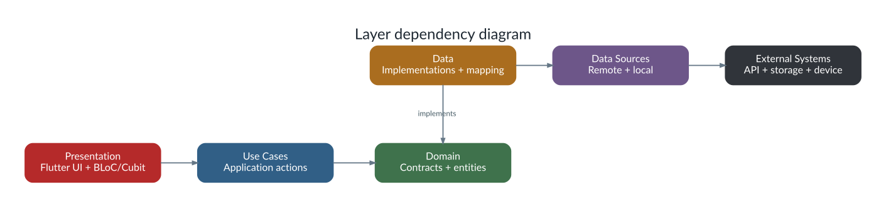<figcaption></figcaption></figure>

_Figure 5. Concise layer dependency reference._

<details>

<summary>Editable Mermaid source</summary>

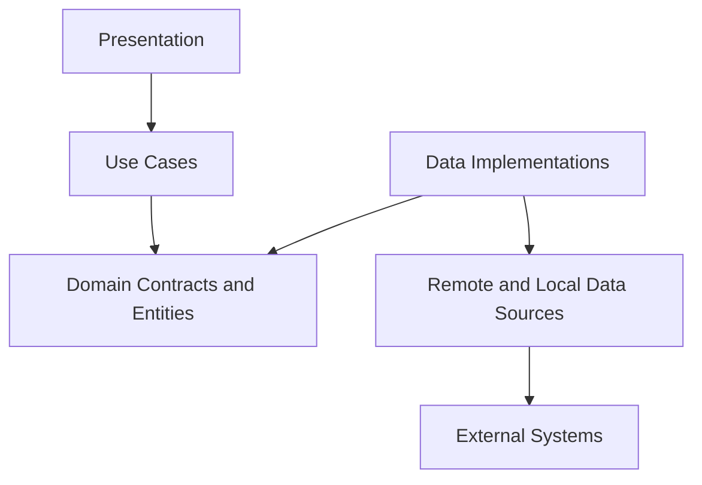

</details>

### 24.2 Repository cache decision

<figure>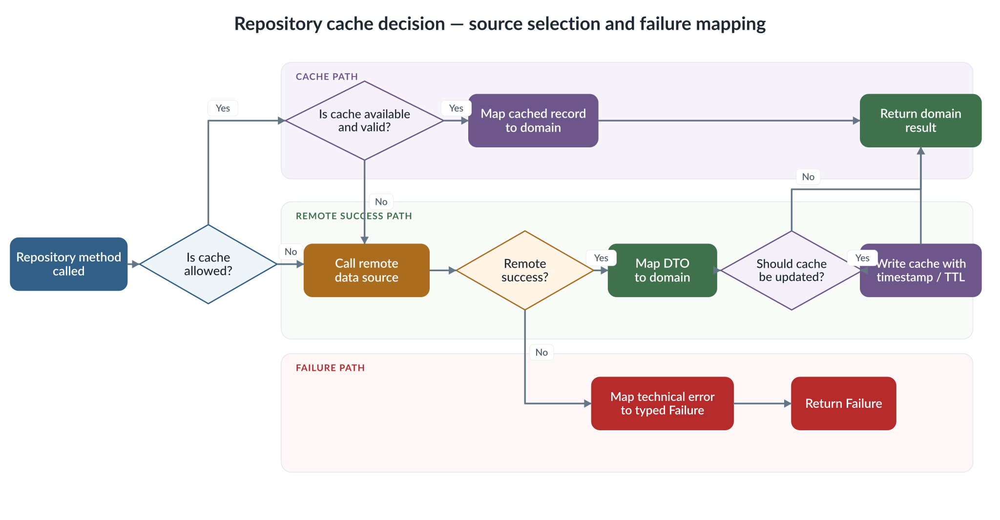<figcaption></figcaption></figure>

_Figure 6. Repository cache decision and failure-mapping flow._

<details>

<summary>Editable Mermaid source</summary>

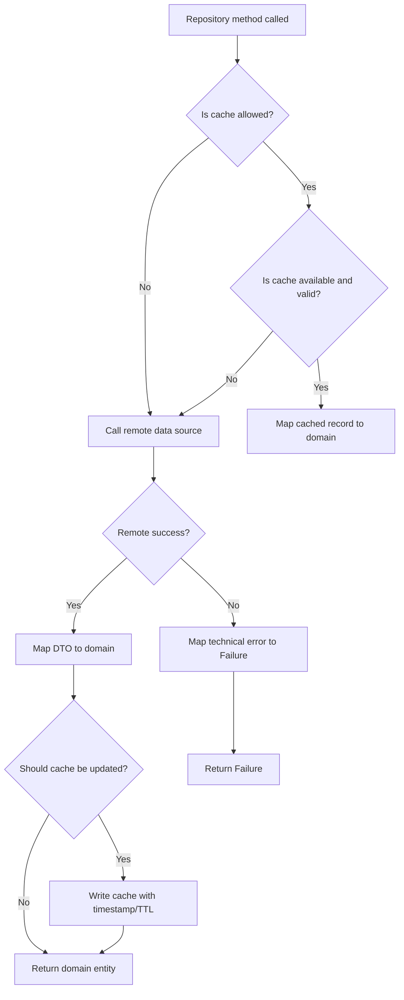

</details>

### 24.3 BLoC state progression

<figure>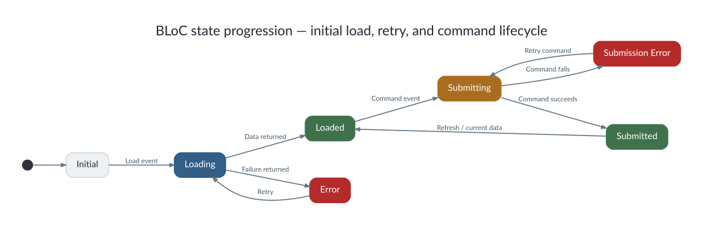<figcaption></figcaption></figure>

_Figure 7. BLoC state progression for load, retry, command success, and command failure._

<details>

<summary>Editable Mermaid source</summary>

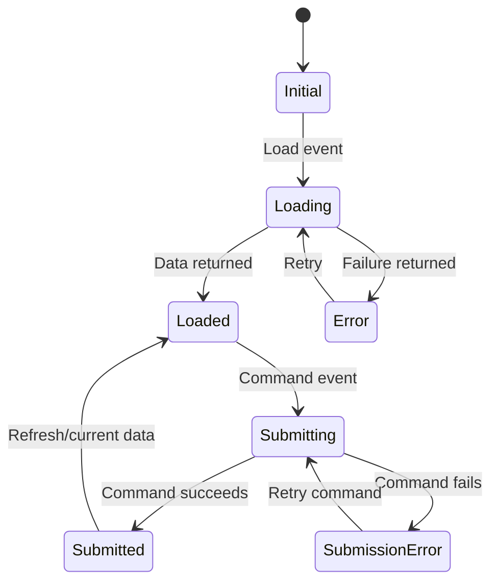

</details>

### 24.4 Feature delivery flow

<figure>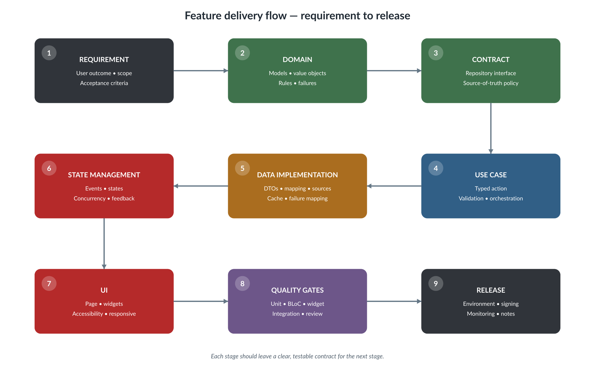<figcaption></figcaption></figure>

_Figure 8. Feature delivery flow from requirement to release._

<details>

<summary>Editable Mermaid source</summary>

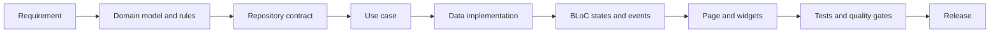

</details>

***

## 25. References and maintenance notes

This guide is based on the existing Clean Architecture App Guide and extends it with general coding, naming, immutability, Freezed, UI, security, performance, testing, and review standards.

Primary guidance should be reviewed against current official documentation when the SDK or major packages change:

* Dart Effective Dart: `https://dart.dev/effective-dart`
* Dart class modifiers: `https://dart.dev/language/class-modifiers`
* Dart linter rules: `https://dart.dev/tools/linter-rules`
* Flutter app architecture: `https://docs.flutter.dev/app-architecture`
* Flutter testing: `https://docs.flutter.dev/testing/overview`
* Flutter accessibility testing: `https://docs.flutter.dev/ui/accessibility/accessibility-testing`
* Flutter performance best practices: `https://docs.flutter.dev/perf/best-practices`
* BLoC architecture and testing: `https://bloclibrary.dev/architecture/` and `https://bloclibrary.dev/testing/`
* Freezed package documentation: `https://pub.dev/packages/freezed`

### Maintenance rule

Review this document when any of the following occurs:

* a major Dart, Flutter, BLoC, Freezed, networking, or DI upgrade;
* a new offline or caching strategy;
* a significant security or privacy requirement;
* repeated code-review findings show that a rule is unclear;
* a new platform, form factor, or delivery pipeline is introduced.

Record approved exceptions in the relevant feature TDD. An exception should include the reason, impact, owner, test coverage, and whether it is temporary or permanent.

>
